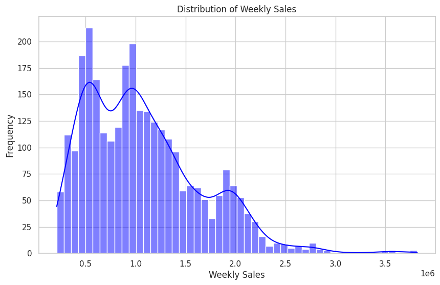
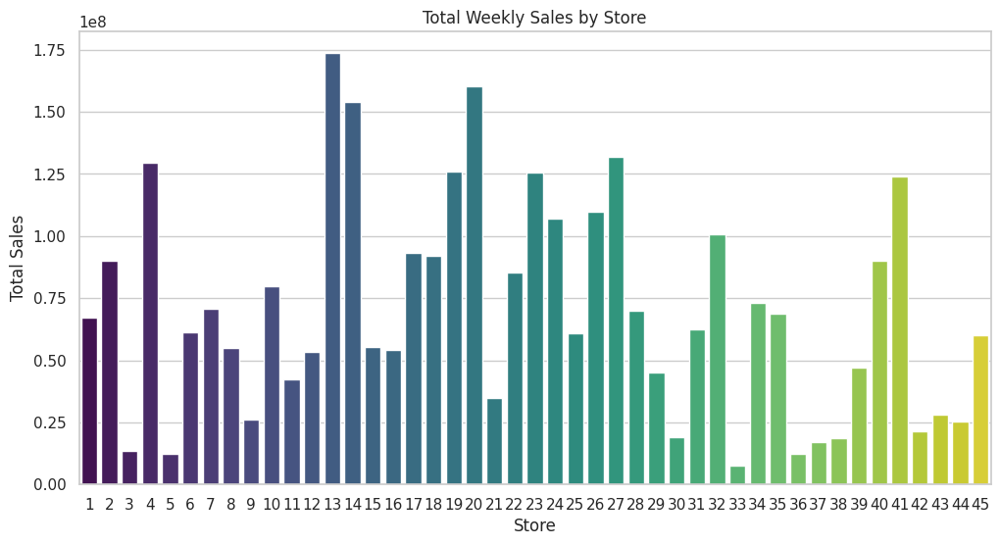
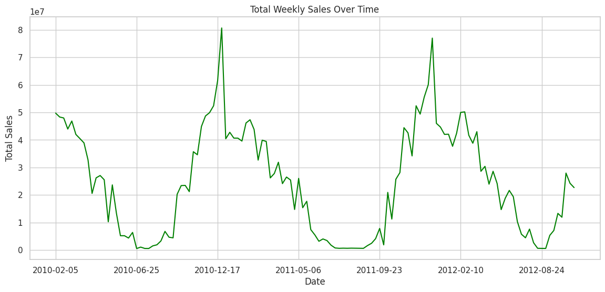
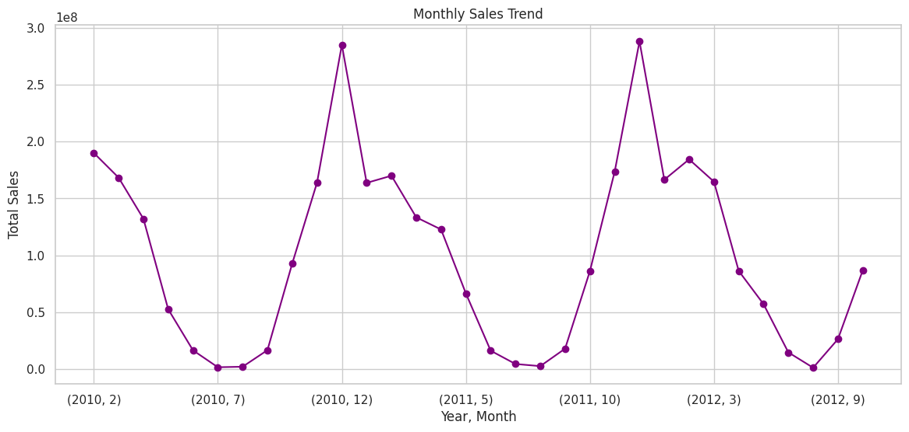
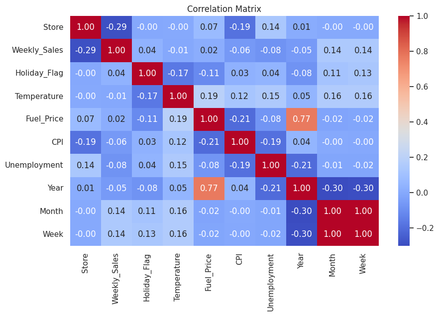
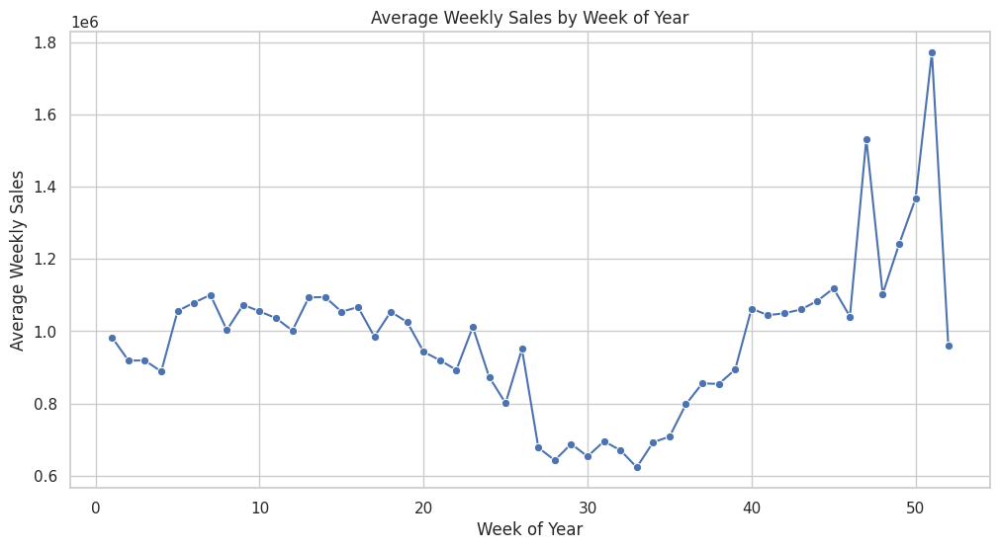

# Walmart Sales Analysis 📈


---

## Project Overview

**Walmart Sales Analysis** is a comprehensive data analysis project on Walmart’s historical weekly sales.  
The goal is to generate **actionable insights** through visualizations and quantitative analysis, including:

- Distribution of weekly sales  
- Sales trends over time  
- Store-level performance comparison  
- Correlation with external factors (temperature, fuel price, CPI, unemployment)  
- Seasonality analysis  

This project helps identify patterns, inform **strategic retail decisions**, and serve as a foundation for forecasting and operational planning.

---

## Repository Structure

```text
Walmart-Sales-Analysis/
│
├── data/                       
│   ├── Walmart_sales.csv
│   └── Walmart_sales_clean.csv
│
├── visualization/                     
│   ├── average_weekly_sales_by_week_of_year.png
│   ├── correlation_matrix.png
│   ├── distribution_of_weekly_sales.png
│   ├── monthly_sales_trend.png
│   ├── random_forest_actual_vs_predicted.png
│   ├── random_forest_freature_importance.png
│   ├── temperature_vs_weekly_sales.png
│   ├── total_weekly_sales_by_store.png
│   └── total_weekly_sales_over_time.png
│
├── scripts/                    
│   └── main_analysis.py
│
├── notebooks/                  
│   └── walmart_analysis.ipynb
│
├── README.md                   
└── requirements.txt
```
## 🔍 Key Features & Analyses

1. **Weekly Sales Distribution** – Histogram with KDE  
   

2. **Store Performance** – Total weekly sales by store  
   

3. **Time Series Analysis** – Weekly and monthly sales trends  
     
   

4. **Correlation & External Factors** – Analysis of relationships between sales and numeric variables  
   

5. **Seasonality Analysis** – Average weekly sales patterns  
   

6. **Exported Visualizations** – All plots are automatically saved in the `visualization/` directory  

---

## Technologies

- **Python 3.x**  
- **Pandas** – Data manipulation  
- **Matplotlib** & **Seaborn** – Visualization  
- **Jupyter Notebook** – Interactive exploration  

Install dependencies with:

```bash
pip install -r requirements.txt
     
